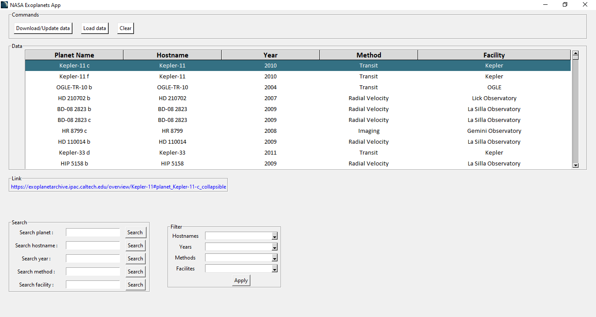

# NASA Exoplanet Query

**Tier:** 3-Advanced

Since 1992 over 4,000 exoplanets have been discovered outside our solar
system. The United States National Aeronautics and Space Administration (NASA)
maintains a publicly accessible archive of the data collected on these in
comma separated value (CSV) format.

The objective of the NASA Exoplanet Query app is to make this data available 
for simple queries by its users. 

### Requirements & Constraints

- The Developer should implement a means of efficiently loading the exoplanet
CSV data obtained from NASA to minimize any delays when the application starts.

- Similarly, the Developer should utilize a data structure and search mechanism
that minimizes the time required to query the exoplanet data and display the
results.

- The Developer will need to review the Exoplanet Archive documentation to
understand the format of the data fields.

## User Stories

-   [x] User can see an query input panel containing dropdowns allowing the
user to query on year of discovery, discovery method, host name, and discovery
facility.

-   [x] User can also see 'Clear' and 'Search' buttons in the query input panel.

-   [x] User can select a single value from any one or all of the query
dropdowns.

-   [x] User can click the 'Search' button to search for exoplanets matching
all of the selected query values.

-   [x] User can see an error message if the 'Search' button was clicked, but
no query values were selected.

-   [x] User can see the matching exoplanet data displayed in tabular format 
in an results panel below the query panel. Only the queriable fields should
be displayed.

-   [x] User can click the 'Clear' button to reset the query selections and
clear any data displayed in the results panel, if a search had been performed.

## Bonus features

-   [x] User can see the host name as a hyperlink to NASA's Confirmed Planet
Overview Page for that planet

-   [ ] User can see icons (such as up and down symbols) in the column headers

-   [ ] User can click on the up symbol to sort the rows in the results panel
in ascending order on the values in that column.

-   [ ] User can click on the down symbol to sort the rows in the results panel
in descending order on the values in the column. 

## Image

## Useful links and resources

- [Big O Notation (Wikipedia)](https://en.wikipedia.org/wiki/Big_O_notation)
- [CSV2JSON](https://github.com/florinpop17/app-ideas/blob/master/Projects/1-Beginner/CSV2JSON-App.md)
- [Exoplanet (Wikipedia)](https://en.wikipedia.org/wiki/Exoplanet)
- [NASA Exoplanet Archive](https://exoplanetarchive.ipac.caltech.edu/cgi-bin/TblView/nph-tblView?app=ExoTbls&config=PS)